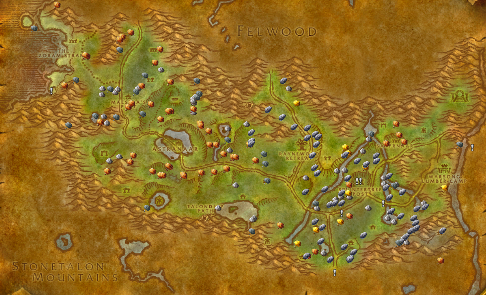

# pfQuest-icons

An extension for pfQuest to use [Gatherer](https://www.curseforge.com/wow/addons/gatherer) icons on resource nodes (`/db herbs`, `/db mines`, `/db chests`).

## Installation (Vanilla, 1.12)
*The latest version of [pfQuest](https://shagu.org/pfQuest) is required for this module to work.*

1. Download **[Latest Version](https://github.com/shagu/pfQuest-icons/archive/master.zip)**
2. Unpack the Zip file
3. Rename the folder "pfQuest-icons-master" to "pfQuest-icons"
4. Copy "pfQuest-icons" into Wow-Directory\Interface\AddOns
5. Restart Wow

## Installation (The Burning Crusade, 2.4.3)
*The latest version of [pfQuest](https://shagu.org/pfQuest) is required for this module to work.*

1. Download **[Latest Version](https://github.com/shagu/pfQuest-icons/archive/master.zip)**
2. Unpack the Zip file
3. Rename the folder "pfQuest-icons-master" to "pfQuest-icons-tbc"
4. Copy "pfQuest-icons-tbc" into Wow-Directory\Interface\AddOns
5. Restart Wow
